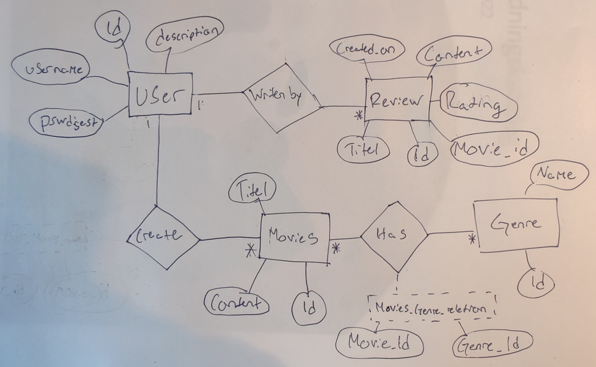

# Projektplan

## 1. Projektbeskrivning (Beskriv vad sidan ska kunna göra).
Min sida ska vara en liten IMDB sida. IMDB är en sida som gör det möjligt för användare att ge reviews till olika filmer de gillar eller hatar. Sidan ska innehålla möjligheten för användaren att skapa ett konto för att kunna skapa reviews och filmer i sitt namn. Man ska kunna lägga till egna filmer man har gjort och skriva beskrivningar om vad filmen handlar om. Man ska också kunna skapa en review på en film smo man har en åsikt på och innom denna review ska man ge en rating från 1 till 10 och skriva en beskrivning där man kan gå mer inpå vad man gillar eller inte gillar om filmen.   
## 2. Vyer (visa bildskisser på dina sidor).

## 3. Databas med ER-diagram (Bild på ER-diagram).

## 4. Arkitektur (Beskriv filer och mappar - vad gör/innehåller de?).

