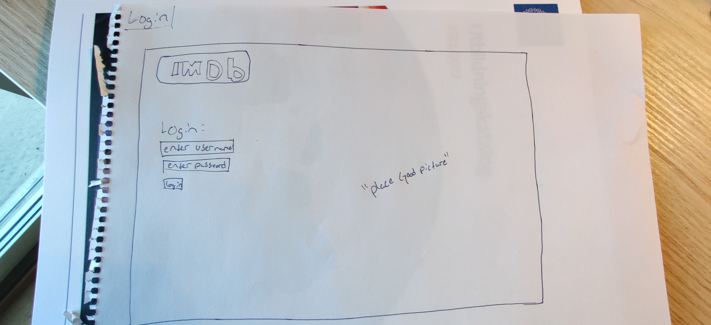
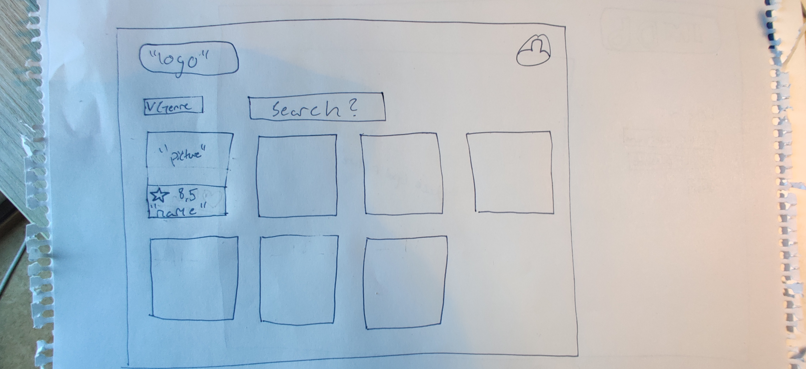
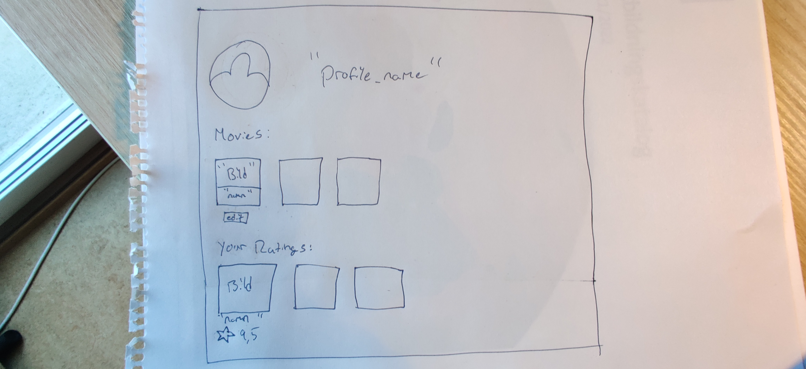
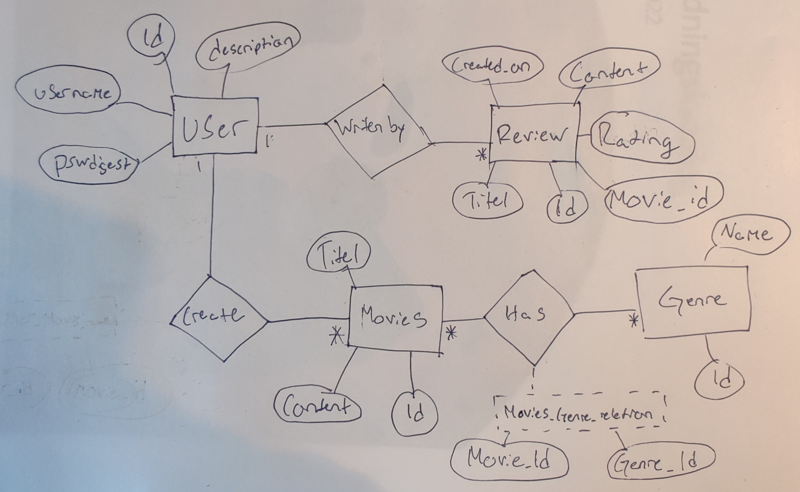

# Projektplan

## 1. Projektbeskrivning (Beskriv vad sidan ska kunna göra).
Min sida ska vara en liten IMDB sida. IMDB är en sida som gör det möjligt för användare att ge reviews till olika filmer de gillar eller hatar. Sidan ska innehålla möjligheten för användaren att skapa ett konto för att kunna skapa reviews och filmer i sitt namn. Man ska kunna lägga till egna filmer man har gjort och skriva beskrivningar om vad filmen handlar om. Man ska också kunna skapa en review på en film smo man har en åsikt på och innom denna review ska man ge en rating från 1 till 10 och skriva en beskrivning där man kan gå mer inpå vad man gillar eller inte gillar om filmen.   
## 2. Vyer (visa bildskisser på dina sidor).

## 3. Databas med ER-diagram (Bild på ER-diagram).

## 4. Arkitektur (Beskriv filer och mappar - vad gör/innehåller de?).
app.rb är hjärnan i webbsevern, den innehåller kod som får in info från webbsidan som att användaren tryckte på en specifik knapp och då vet app.rb vad den knappen gör. Man kan tänka den som en server som visar var clienter ska gå och allmänt vad som händer på webbläsaren
model.rb är en separat del av "serven/app.rb" som hjälper app.rb se mer snyggare ut genom att hjälpa app.rb med olika funktioner som ofta kan bli väldigt långa och inte ha dem i app.rb
i views foldern finns alla views som är alla sidor som man kan komma in på. I foldern så finns det slim filer som app.rb kan slima ihop för att visa upp för clienten vad som ska visas. 
Public mappen är en map som clienten kan öppet se och innehåller information som webbsidan behöver visa som css kod, olika bilder eller annaat som clienten kan behöva. 
db mappen som man kan tänka sig innehåller databasen till sebbsidan. i databasen innehåller webbsidans information som personer som har gjort konton eller i mitt fall filmer och reviews som personer har lagt på dem. Detta gör att alla som kommer in på min webbsidan kan se all information för app.rb tar databasen och instruerar slim att visa viss information som finns i min databas

